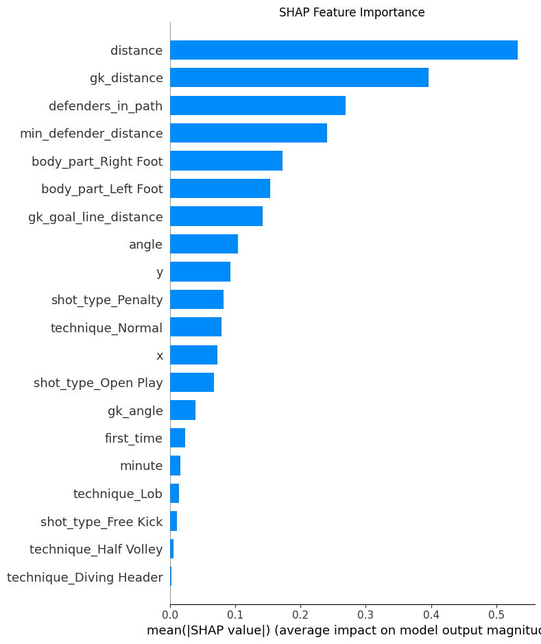
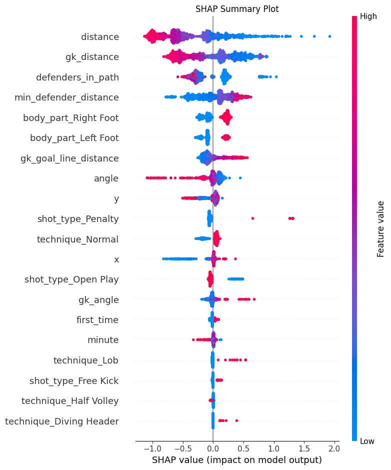
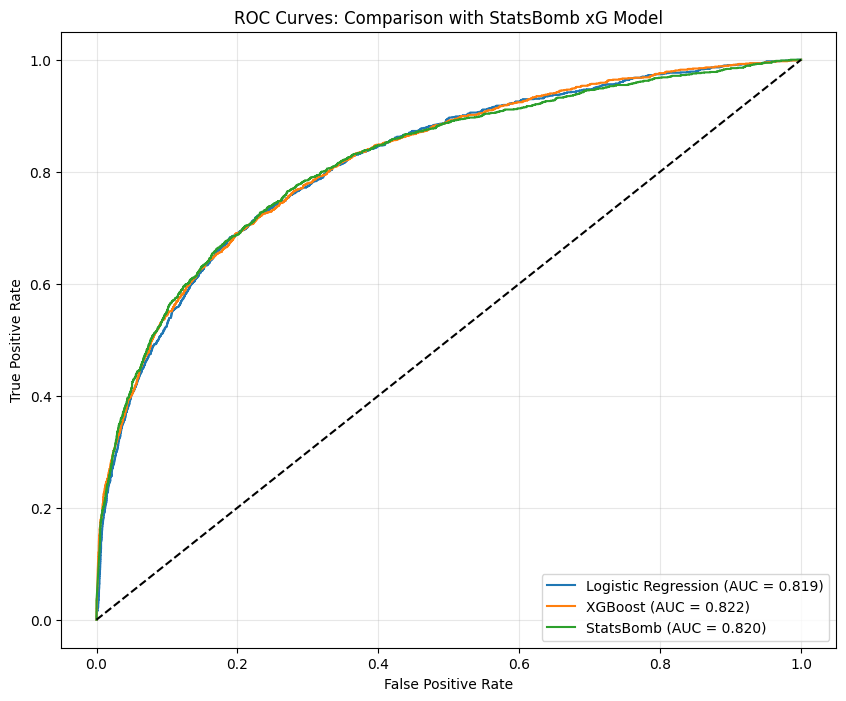
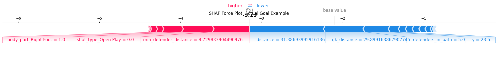
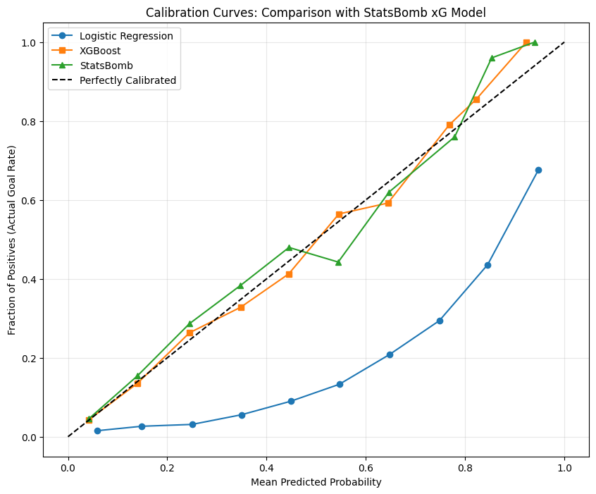

# Football Analytics

Football analytics (xG model, score predictions) using data from [statsbomb](https://github.com/statsbomb/open-data).

You can play with the xG model [here](https://xg-model-predictor.onrender.com/).

## Setup

Ensure you have Python 3.10 installed. You can install it using [pyenv](https://github.com/pyenv/pyenv).

```bash
make install
```

## Understanding xG

Expected Goals (xG) is a metric that measures the probability of a shot resulting in a goal based on various factors like:

- Shot location
- Shot angle
- Body part used
- Type of attack (open play, set piece, etc.)
- Defensive pressure
- And many other variables

## Statsbomb Data

Statsbomb provides high-quality soccer event data. They offer:

1. Free open data through their GitHub repository
2. Paid access to more extensive datasets

For this project, we can start with their free dataset, which includes competitions like the Women's World Cup, men's Champions League finals, and others.

## xG model

We use a XGBoost model to predict the probability of a shot being successful.





### Training

We train the XGBoost model using the following after a grid search for the best hyperparameters. We compare the model's performance with a Logistic Regression model and the baseline Statsbomb xG model.



### Individual shots

We can also look at the contribution of each feature to the model's prediction for a specific shot.



## Model calibration

We use plot the calibration curve of our model to check if it is well calibrated.



## Deployment

We deploy the model using FastAPI and deploy it on Render. The frontend is a simple HTML page that allows you to play with the model, using JavaScript to send the data to the backend and display the results.
