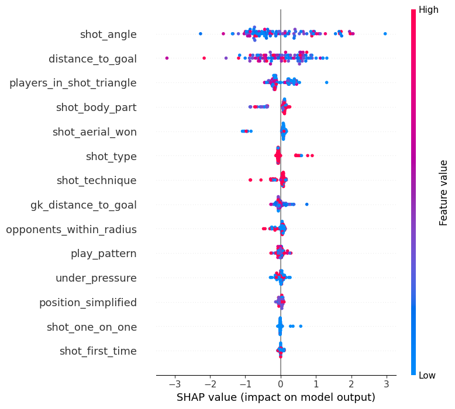

# Football Analytics

Football analytics (xG model, score predictions) using data from [statsbomb](https://github.com/statsbomb/open-data).

## Setup

Ensure you have Python 3.10 installed. You can install it using [pyenv](https://github.com/pyenv/pyenv).

```bash
make install
```

## Understanding xG

Expected Goals (xG) is a metric that measures the probability of a shot resulting in a goal based on various factors like:

- Shot location
- Shot angle
- Body part used
- Type of attack (open play, set piece, etc.)
- Defensive pressure
- And many other variables

## Statsbomb Data

Statsbomb provides high-quality soccer event data. They offer:

1. Free open data through their GitHub repository
2. Paid access to more extensive datasets

For this project, we can start with their free dataset, which includes competitions like the Women's World Cup, men's Champions League finals, and others.

## xG model

Our xG model uses the following features:



We use a multi-layer perceptron (MLP) model to predict the probability of a shot being successful.

## Score predictions

We run a score prediction model using the xG model as the base model, by summing the xG of all shots for each team. Using this approach we calculate the final score of the champions league final between AC Milan and Liverpool.

AC Milan: 2.75 xG, Liverpool: 1.41 xG

## Model calibration

We use the [CalibratedClassifierCV](https://scikit-learn.org/stable/modules/calibration.html#calibration) class from scikit-learn to calibrate our model. In the end our initial model is highly calibrated already.
